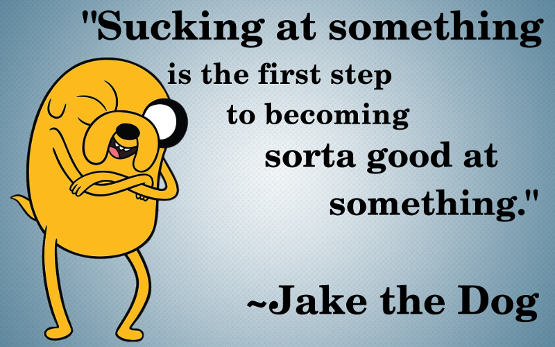

Introduction
============

`From Wikipedia`_:
  In programming and hacking culture, a script kiddie, skiddie, or skid is an unskilled individual who uses scripts or programs developed by others to attack computer systems and networks [...]. It is generally assumed that most script kiddies [...] lack the ability to write sophisticated programs or exploits on their own [...]. The term is considered to be derogatory.

.. _From Wikipedia: https://en.wikipedia.org/wiki/Script_kiddie

Hey, everyone. Thanks for joining me here today. I'd like to get something off my chest; it's something I've been struggling with for some time, and I've decided that it's time to speak up. So, here goes:

`I'm a script kiddie.`

Whew! Feels good to get that out there. I'll say it again: I'm a skid! And that's okay. You're one, too. So is everybody. Now, before some super 1337 h4x0r comes pounding down my digital door in a huff, let me ask: Is there anything in your life that you take for granted, without really understanding how it works?

I drive my car every day, but I don't know squat about cars. I mean, I know they need air in the tires, gas in the tank, and regular oil changes, but I couldn't tell a crank shaft from a spark plug.

I use my microwave to make my popcorn. Do I know anything about how microwaves work? Barely. It's, like, 99% magic. Throw in seeds, push a button, and popcorn appears. Voila!

I use other people's inventions every single day without ever knowing how they work. Granted, I might not be bragging to my friends every time I make a bag of popcorn or get my oil changed, but the fact remains: in many aspects of life, I'm a total skid. `And that's okay.`

In the `Hacker Jargon File`_, a "hacker" is "an expert or enthusiast of any kind," or "one who enjoys the intellectual challenge of creatively overcoming or circumventing limitations."

.. _Hacker Jargon File: http://catb.org/jargon/html/H/hacker.html

If we apply the same liberal brush to the term "script kiddie," we could say that a skid is someone who takes advantage of systems in their environment without any deeper understanding or appreciation for how those systems function.

We're all skids at first. We're born skids, dependent on the world and people around us, and utterly clueless as to how any of it works. But as we learn, we grow, until we're not so skiddish anymore. And that's the secret: To stop being a skid, all you gotta do is `learn more`.

That's what **No Skids Allowed!** is all about. It's not about skid-shaming, it's about learning and improving and growing, so that one day, at least in one way, we might rightfully call ourselves "hackers." It's a promise to yourself that you won't ever stop learning.

If you ever get down on yourself because you feel like a skid... Just remember:

