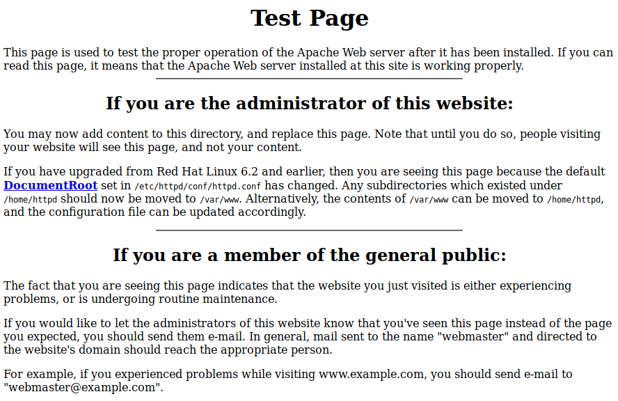

.. _Kioptrix Level 1 Enumeration:

Enumeration
===========

+-------------+--------------------------+
|**Reference**|:ref:`arp-scan <arp-scan>`|
|             |                          |
|             |:ref:`nmap <nmap>`        |
+-------------+--------------------------+

Finding the Target's IP
-----------------------

.. index::
   single: arp-scan

Before we can start scanning our target for open ports and running services, we must first identify where it is on the network. There are a number of ways to do this, but for the purposes of this tutorial, we'll use the `arp-scan` utility.

Before we run `arp-scan`, we need to know what our IP is, so we know which subnet to scan. For this, we can use the ``ip a`` command:

.. code-block:: none

    kali@kali:~$ ip a
    [...]
    3: eth1: <BROADCAST,MULTICAST,UP,LOWER_UP> mtu 1500 qdisc pfifo_fast state UP group default qlen 1000
        link/ether 08:00:27:85:c7:a2 brd ff:ff:ff:ff:ff:ff
        inet 10.1.1.100/24 brd 10.1.1.255 scope global dynamic noprefixroute eth1
           valid_lft 502sec preferred_lft 502sec
        inet6 fe80::a00:27ff:fe85:c7a2/64 scope link noprefixroute
           valid_lft forever preferred_lft forever

My system's IP is ``10.1.1.100``. Yours may be different. Be sure to take note of the IP, because you'll need it later!

The command-line we'll use for `arp-scan` is as follows:

.. code-block:: none

    sudo arp-scan -I eth1 -l

Notice that we're using the ``-l`` flag. This will scan the entire local subnet. Also, we need to specify the network interface on which the VMs reside, using the ``-I`` command-line argument. In this example, I'm using ``eth1``, as this is the interface revealed in the previous ``ip a`` command. You'll want to modify your `arp-scan` command to suit the subnet and network interface on which your `Kali` and `Kioptrix` VMs reside.

Here's what the output of the tool looks like:

.. code-block:: none

    kali@kali:~$ sudo arp-scan -I eth1 -l
    Interface: eth1, type: EN10MB, MAC: 08:00:27:85:c7:a2, IPv4: 10.1.1.100
    Starting arp-scan 1.9.7 with 256 hosts (https://github.com/royhills/arp-scan)
    10.1.1.1        0a:00:27:00:00:00       (Unknown: locally administered)
    10.1.1.1        08:00:27:72:bd:42       PCS Systemtechnik GmbH (DUP: 2)
    10.1.1.102      08:00:27:4d:93:21       PCS Systemtechnik GmbH

    3 packets received by filter, 0 packets dropped by kernel
    Ending arp-scan 1.9.7: 256 hosts scanned in 2.113 seconds (121.15 hosts/sec). 3 responded

In this example, we can see that `arp-scan` identified our local IP as ``10.1.1.100``, as seen in the top-right corner of the tool's output. Following this, the tool lists the IPs and MAC addresses of the rest of the systems discovered on the network. The ``10.1.1.1`` IP is managed by `VirtualBox`'s virtual networking subsystem. ``10.1.1.102``, on the other hand, is the IP of `Kioptrix Level 1`, our target for this exercise.

.. _Kioptrix Level 1 Port Scanning:

Scanning for Open Ports
-----------------------

.. index::
   single: nmap

Now that we've determined the IP address of the target system, let's see what ports are open. For this, we'll use `nmap`, with the ``-sV`` and ``-O`` flags enabled, to identify the services and OS running on the target:

.. code-block:: none

    kali@kali:~$ sudo nmap -sV -O 10.1.1.102
    Starting Nmap 7.80 ( https://nmap.org ) at 2020-04-06 14:05 EDT
    Nmap scan report for 10.1.1.102
    Host is up (0.0030s latency).
    Not shown: 994 closed ports
    PORT      STATE SERVICE     VERSION
    22/tcp    open  ssh         OpenSSH 2.9p2 (protocol 1.99)
    80/tcp    open  http        Apache httpd 1.3.20 ((Unix)  (Red-Hat/Linux) mod_ssl/2.8.4 OpenSSL/0.9.6b)
    111/tcp   open  rpcbind     2 (RPC #100000)
    139/tcp   open  netbios-ssn Samba smbd (workgroup: MYGROUP)
    443/tcp   open  ssl/https   Apache/1.3.20 (Unix)  (Red-Hat/Linux) mod_ssl/2.8.4 OpenSSL/0.9.6b
    32768/tcp open  status      1 (RPC #100024)
    MAC Address: 08:00:27:4D:93:21 (Oracle VirtualBox virtual NIC)
    Device type: general purpose
    Running: Linux 2.4.X
    OS CPE: cpe:/o:linux:linux_kernel:2.4
    OS details: Linux 2.4.9 - 2.4.18 (likely embedded)
    Network Distance: 1 hop

    OS and Service detection performed. Please report any incorrect results at https://nmap.org/submit/ .
    Nmap done: 1 IP address (1 host up) scanned in 33.98 seconds

Based on this quick scan, we can see that the system appears to be running `Linux`, with a number of open ports. We see `OpenSSH` on port 22, `Apache httpd 1.3.20` on ports 80 and 443, `Samba smbd` on port 139, and `RPC` (Remote Procedure Call) on ports 111 and 32768. We can also see that the target is running `Red-Hat Linux`, based on the information provided by `Apache`.

Now that we know what ports are available, we should prioritize them to determine which would be the most valuable targets for further enumeration. Based on personal experience, I will say that `OpenSSH` isn't likely to provide much data for enumeration, nor is `RPC` on ports 111 or 32768. As a result, we'll skip enumerating those ports, and will return to them only if our exploration of the `Apache` and `Samba` services prove fruitless.

Enumerating Apache
------------------
Between `Samba` and `Apache`, it's hard to decide which would be the better target for our initial enumeration. However, generally speaking, web servers are often a more attractive target, as they often feature poorly-constructed websites with numerous security flaws.

Our first step is, quite simply, to connect to the service using a normal web browser, just to see what's there. If this were a real penetration test, this would be the least-conspicuous way to approach the target, as it is unlikely to set off any alarms in their defenses.

First, we'll check the HTTP site on port 80, by visiting ``http://10.1.1.102/`` in `Firefox`. Here we discover a default `Apache` test page, demonstrating that the `Apache` service has been successfully installed on the system (see Figure 1).

   The default `Apache` test page.

Next, we'll check out the site on port 443, by visiting ``https://10.1.1.102/`` in `Firefox`. We are presented with a warning (see Figure 2).

   Warning: Potential Security Risk Ahead

Our first impulse might be to quickly click through the warning and move on to the site, but it's always a good idea to inspect the warnings you receive, in order to learn what you can from them. In this case, we'll click the **Advanced...** button, which informs us that this website's certificate is invalid. It's always a good idea to click **View Certificate**, just to see what you can learn. In this case, there isn't much value provided by the certificate, so we'll go ahead and click **Accept the Risk and Continue**.

After passing through the security warning, we're once again presented with the default `Apache` test page. With that, we've pretty much reached the end of what we can do with `Firefox`, as these test pages don't really provide us with much to work with. We can go ahead and close the browser.

Looking back to our `nmap` scan, we can see some additional details about the `Apache` installation on this system. The returned version information was as follows:

.. code-block:: none

    Apache httpd 1.3.20 ((Unix)  (Red-Hat/Linux) mod_ssl/2.8.4 OpenSSL/0.9.6b)

From this information, we know the following:

* `Apache` is version 1.3.20.
* The Operating System is `Red-Hat Linux`.
* `Apache` has at least two modules installed: `mod_ssl` version 2.8.4, and `OpenSSL` version 0.9.6b

This is all useful information, so we'll make a note of it.

Our next course of action could be to use a tool like `dirbuster` to attempt a brute-force enumeration attack on the target in order to see if there are any secret pages or directories on the server, but this is time-consuming, and is very noisy. In a real penetration test, using such a tool is likely to raise some alarms and get you caught. So, for now, we'll skip this step, returning to it later if we're unable to find another vector for attack.

Enumerating Samba
-----------------
With `Apache` out of the way, our next target for enumeration is `Samba`, on port 139. `Samba` is an open-source implementation of the Server Message Block (SMB) protocol, and has historically been a prime target for exploitation. Let's see what we can learn about this service.

.. note::

    If you'll recall, `Kioptrix Level 1` was published to `VulnHub` back in 2010. Since then, the `Samba` software has undergone significant updates. As a result, the `Samba` client software in the latest `Kali Linux` distribution is no longer compatible with the `Samba` service on `Kioptrix Level 1` in its default configuration. Thus, the various tools and techniques employed in this section won't work without some modification. Fortunately, this process is fairly easy. All you have to do is modify the ``/etc/samba/smb.conf`` file on `Kali Linux`. To do this, just run ``sudo nano /etc/samba/smb.conf``, then add the following two lines just after the ``[global]`` line:

    .. code-block:: none

        client min protocol = CORE
        client max protocol = SMB3

    This will tell `Kali` to allow the use of the outdated `Samba` protocols necessary to interact with our target.

.. index::
   single: enum4linux
   single: tee

One of the most useful utilities for enumerating `Samba` is `enum4linux`. This tool connects to the target system and attempts to gather as much information as it possibly can about the target. As a result, it can generate a `ton` of information. For this reason, I like to save its output into a file so that I can parse through it again later if I overlooked something the first time around. To do this, I'll use the `tee` utility to save the output of the `enum4linux` tool into a file called ``kioptrix_lv1.enum4linux``:
