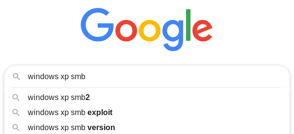
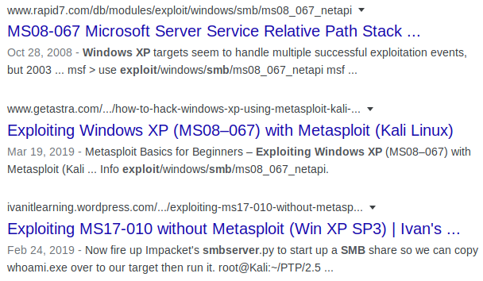

.. _Legacy Vulnerability Scanning:

Vulnerability Scanning
======================

+-------------+------------------+
|**Reference**|:ref:`nmap <nmap>`|
+-------------+------------------+

Typing ``windows xp smb`` into the search bar, Google provides us with some troubling auto-completion suggestions:

Let's go ahead and search for ``windows xp smb exploit`` and see what comes up:

The top three results mention **MS08-067** and **MS17-010**. These strange codes refer to Microsoft's security patches, which are named by the year and patch number. **MS08-067** was the 67th patch released in 2008, and **MS17-010** was the 10th patch released in 2017. Let's take a closer look at these two patches. Performing a Google search for each, you'll find a Microsoft page describing the vulnerabilities in more detail. Looking at the security bulletin for **MS08-067** [#]_, we see that it involves a **Remote Code Execution (RCE)** vulnerability, and is rated "Critical." Likewise, the bulletin for **MS17-010** [#]_ also involves a Critical RCE vulnerability.

.. [#] https://docs.microsoft.com/en-us/security-updates/securitybulletins/2008/ms08-067
.. [#] https://docs.microsoft.com/en-us/security-updates/securitybulletins/2017/ms17-010

.. note::

    The definition of a **Remote Code Execution** vulnerability can be found in the :ref:`Glossary`.

Now that we've found a couple potential vulnerabilities, let's see if the target is vulnerable. One of `nmap`'s coolest features is its scripting engine, which enables it to perform more complex tasks such as deeper enumeration of a target's ports, vulnerability scanning, and even active exploitation. On `Kali Linux`, the `nmap` scripts are stored in ``/usr/share/nmap/scripts/``. Let's see if any scripts exist for either of the vulnerabilities we discovered:

.. code-block:: none

    kali@kali:~$ cd /usr/share/nmap/scripts/
    kali@kali:/usr/share/nmap/scripts$ ls -l *ms17-010* *ms08-067*
    -rw-r--r-- 1 root root 5688 Nov 26 04:21 smb-vuln-ms08-067.nse
    -rw-r--r-- 1 root root 7344 Nov 26 04:21 smb-vuln-ms17-010.nse

Nice! There's a script for each of the vulnerabilities we discovered. Now let's test them against the target.

.. code-block:: none

    kali@kali:~$ nmap -Pn -p139,445 --script smb-vuln-ms08-067,smb-vuln-ms17-010 10.10.10.4
    Starting Nmap 7.80 ( https://nmap.org ) at 2020-03-14 17:33 EDT
    Nmap scan report for 10.10.10.4
    Host is up (0.054s latency).

    PORT    STATE SERVICE
    139/tcp open  netbios-ssn
    445/tcp open  microsoft-ds

    Host script results:
    | smb-vuln-ms08-067:
    |   VULNERABLE:
    |   Microsoft Windows system vulnerable to remote code execution (MS08-067)
    |     State: LIKELY VULNERABLE
    |     IDs:  CVE:CVE-2008-4250
    |           The Server service in Microsoft Windows 2000 SP4, XP SP2 and SP3, Server 2003 SP1 and SP2,
    |           Vista Gold and SP1, Server 2008, and 7 Pre-Beta allows remote attackers to execute arbitrary
    |           code via a crafted RPC request that triggers the overflow during path canonicalization.
    |
    |     Disclosure date: 2008-10-23
    |     References:
    |       https://technet.microsoft.com/en-us/library/security/ms08-067.aspx
    |_      https://cve.mitre.org/cgi-bin/cvename.cgi?name=CVE-2008-4250
    | smb-vuln-ms17-010:
    |   VULNERABLE:
    |   Remote Code Execution vulnerability in Microsoft SMBv1 servers (ms17-010)
    |     State: VULNERABLE
    |     IDs:  CVE:CVE-2017-0143
    |     Risk factor: HIGH
    |       A critical remote code execution vulnerability exists in Microsoft SMBv1
    |        servers (ms17-010).
    |
    |     Disclosure date: 2017-03-14
    |     References:
    |       https://blogs.technet.microsoft.com/msrc/2017/05/12/customer-guidance-for-wannacrypt-attacks/
    |       https://cve.mitre.org/cgi-bin/cvename.cgi?name=CVE-2017-0143
    |_      https://technet.microsoft.com/en-us/library/security/ms17-010.aspx

    Nmap done: 1 IP address (1 host up) scanned in 3.63 seconds

From these results, it appears as if both vulnerabilities might exist in the target! Our next step is to attempt to exploit these vulnerabilities.
