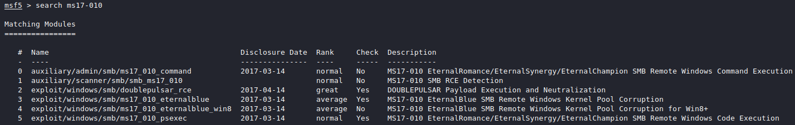

.. _Legacy Exploitation:

Exploitation
============

+-------------+-------------------+
|**Reference**|:ref:`searchsploit`|
|             |                   |
|             |:ref:`Metasploit`  |
+-------------+-------------------+

Confirming that a vulnerability exists and actually exploiting that vulnerability are two entirely different things. Fortunately, there are some useful tools available to help make our lives easier. One of these tools is `SearchSploit`, part of the `Metasploit Framework` (more on this framework later). Let's use `SearchSploit` to see if we can find any exploits for the two discovered vulnerabilities. I'll use the ``--id`` command-line argument to show the `Exploit Database <https://www.exploit-db.com/>`_ ID instead of a URL, for the sake of simplicity.

First, let's look at the results for **MS08-067**:

.. code-block:: none

    kali@kali:~$ searchsploit --id ms08-067
    ------------------------------------------------------------------------------------------- ---------
     Exploit Title                                                                             |  EDB-ID
    ------------------------------------------------------------------------------------------- ---------
    Microsoft Windows - 'NetAPI32.dll' Code Execution (Python) (MS08-067)                      | 40279
    Microsoft Windows Server - Code Execution (MS08-067)                                       | 7104
    Microsoft Windows Server - Code Execution (PoC) (MS08-067)                                 | 6824
    Microsoft Windows Server - Service Relative Path Stack Corruption (MS08-067) (Metasploit)  | 16362
    Microsoft Windows Server - Universal Code Execution (MS08-067)                             | 6841
    Microsoft Windows Server 2000/2003 - Code Execution (MS08-067)                             | 7132
    ------------------------------------------------------------------------------------------- ---------
    Shellcodes: No Result

Wow, there's a lot of options to choose from! Perhaps we should narrow it down a bit. Let's see if there are any exploits designed to work with the `Metasploit Framework`. To do this, simply add the word "Metasploit" to the search query:

.. code-block:: none

    kali@kali:~$ searchsploit --id ms08-067 metasploit
    ------------------------------------------------------------------------------------------- ---------
     Exploit Title                                                                             |  EDB-ID
    ------------------------------------------------------------------------------------------- ---------
    Microsoft Windows Server - Service Relative Path Stack Corruption (MS08-067) (Metasploit)  | 16362
    ------------------------------------------------------------------------------------------- ---------
    Shellcodes: No Result

Wonderful! Normally, it's a good thing to have multiple results, but we're trying to keep things simple for this walk-through, so narrowing it down to a single `Metasploit` module is quite handy.

Now let's see what's available for **MS17-010**, focusing on results that include `Metasploit` modules:

.. code-block:: none

    kali@kali:~$ searchsploit --id ms17-010 metasploit
    ------------------------------------------------------------------------------------------- ---------
     Exploit Title                                                                             |  EDB-ID
    ------------------------------------------------------------------------------------------- ---------
    Microsoft Windows - 'EternalRomance'/'EternalSynergy'/'EternalChampion' SMB Remote Code Ex | 43970
    Microsoft Windows - SMB Remote Code Execution Scanner (MS17-010) (Metasploit)              | 41891
    ------------------------------------------------------------------------------------------- ---------
    Shellcodes: No Result

Nice. Looking closer, you'll notice that the second result is a "scanner." A scanner, in this context, is able to check target systems and verify whether they have a particular vulnerability. While handy, we won't be needing this, as we've already confirmed the vulnerability with `nmap` in the previous section. For this reason, we'll want to focus on the first result, with the EDB ID 43970.

.. index::
   single: Metasploit

We've mentioned the `Metasploit Framework` (MSF) a few times now. MSF is a powerful penetration testing toolkit that is widely-known throughout the global hacker community. In fact, some consider `Metasploit` to be too powerful, becoming a crutch for unskilled hackers. For this reason, we'll avoid using `Metasploit` for the majority of this document. However, since this is our first target, we'll go ahead and use `Metasploit`, to keep things simple.

We now have two possible exploits for two potential vulnerabilities. But which should we try first? Let's look closer at the two `SearchSploit` results on which we chose to focus:

* ``Microsoft Windows Server - Service Relative Path Stack Corruption`` (16362)
* ``Microsoft Windows - 'EternalRomance'/'EternalSynergy'/'EternalChampion'`` (43970)

At the beginning of each exploit's description, the target Operating System is listed. The first exploit (16362) is targeting `Microsoft Windows Server`, while the second (43970) is targeting `Microsoft Windows`. We know that our target is running `Windows XP`, which is not the same as `Windows Server`. Therefore, we should prioritize the second exploit, as it's more likely to apply to our target system. (Remember, this exploit was targeting the vulnerability outlined in **MS17-010**.)

Let's go ahead and open the `Metasploit Framework`. To do this, you can select `Metasploit Framework` from the `Kali Linux` menu. The first time you boot MSF, it will create a new database for storing your pentest information (see Figure 4). Once you see the ``msf5`` command-prompt, the Framework is loaded and ready to go.

   Screenshot of Metasploit creating the initial database.

To begin, we'll need to find the specific exploit returned in our `SearchSploit` results. We can search by the Microsoft security bulletin ID using the ``search ms17-010`` command, but this returns a multitude of results (see Figure 5). We can narrow down these results by searching only for exploits using the ``search type:exploit ms17-010`` command, yet still this returns a number of results (see Figure 6).

   MSF search results for **MS17-010**.

   MSF search results for exploits matching **MS17-010**.

We could potentially search by the specific EDB ID using ``search edb:43970``, but this isn't always reliable. (In fact, in this instance, the exploit won't be found.) Instead, we can recall the title of the result found via `SearchSploit`: ``Microsoft Windows - 'EternalRomance'/'EternalSynergy'/'EternalChampion'``. Looking through the descriptions of the listed exploits, it appears as if the last result is the one we want. To use that exploit, we'll type ``use 3``, telling `Metasploit` to use the exploit beside the number 3 in the list. You'll notice that the command prompt changes to show which exploit is selected:

.. code-block:: none

    msf5 > use 3
    msf5 exploit(windows/smb/ms17_010_psexec) >

Now that we've selected our exploit module, we can type ``show info`` to see more information about the module, including the author, date of publication, related CVEs or Microsoft security bulletins, and more. To see what options we can configure in the module, type ``show options`` (see Figure 7).

   Exploit module options.

There are a number of configurable options here, but we'll leave most of them with their default values. The most important values to us are ``RHOSTS`` and ``RPORT``, as these tell `Metasploit` which IP and port we wish to target. The ``RPORT`` value is already set to 445, which (as you'll recall) was one of the two open ports on our target system, so we'll leave that alone. The ``RHOSTS`` value is empty, however, so we'll need to provide `Metasploit` with the appropriate target IP. To do this, type ``set RHOSTS 10.10.10.4``. Typing ``show options`` again, we can verify that the change was made (see Figure 8).

.. figure:: images/7-set-rhosts.png
   :align: center
   :alt: Verify that RHOSTS is set to 10.10.10.4.

   Verify that ``RHOSTS`` is set to ``10.10.10.4``.

Excellent! Now that the exploit is properly configured, we would typically want to select a payload. MSF comes with a wide variety of built-in payloads targeting a number of Operating Systems and architectures. One of its most powerful payloads is called `Meterpreter`, which provides a ton of useful functionality. When running a MSF exploit module, if no payload is specified, an appropriate `Meterpreter` payload is selected and configured by default. This will work just fine for our needs, so we can go ahead and skip this step.

We're now ready to run the exploit! To launch our attack, execute the ``exploit`` command. A bunch of text will fly by, after which your `Meterpreter` session will open (see Figure 9).

   Running the exploit against the target.

We now have a shell on our target host! The next step is to figure out which user account we've taken over. To do this, use the ``getuid`` command:

.. code-block:: none

    meterpreter > getuid
    Server username: NT AUTHORITY\SYSTEM

We're currently connected as ``NT AUTHORITY\SYSTEM``, which is the most powerful local administrative account on the system. (This is the `Windows` equivalent of the ``root`` account on Unix-like systems.) We have full control!
