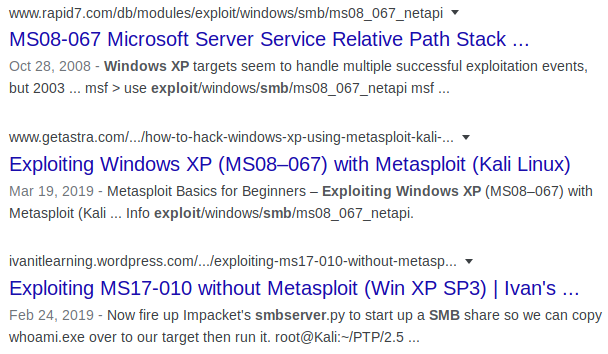

.. _Legacy Vulnerability Scanning:

Vulnerability Assessment
========================

+-------------+-------------------+
|**Reference**|:ref:`nmap <nmap>` |
|             |                   |
|             |:ref:`searchsploit`|
+-------------+-------------------+

Finding Vulnerabilities with Google
-----------------------------------

We've now identified two open ports on the system, as well as the target's OS. That's not a lot of attack surface, but perhaps we can learn something more about the target that will give us a clue as to where to go from here. By searching online, we discover that ports 139 and 445 are part of the `Server Message Block` (SMB) protocol, used "for sharing files, printers, serial ports, and communications abstractions such as named pipes and mail slots between computers." [#]_

.. [#] https://www.samba.org/cifs/docs/what-is-smb.html

The SMB service has seen more than its fair share of vulnerabilities and exploits over the years. Knowing that our target is running `Windows XP` and SMB, let's see what `Google` can tell us about this service.

Typing ``windows xp smb`` into the search bar, `Google` provides us with some troubling auto-completion suggestions.

   Screenshot of `Google` auto-complete results, with 'exploit' in the top three.

Let's go ahead and search for ``windows xp smb exploit`` and see what comes up.

   The top three `Google` results, containing the strings **ms08-067** and **ms17-010**.

The top three results mention **MS08-067** and **MS17-010**. These strange codes refer to Microsoft's security patches, which are named by the year and patch number. **MS08-067** was the 67th patch released in 2008, and **MS17-010** was the 10th patch released in 2017. Let's take a closer look at these two patches. Performing a `Google` search for each, you'll find a Microsoft page describing the vulnerabilities in more detail. Looking at the security bulletin for **MS08-067** [#]_, we see that it involves a **Remote Code Execution (RCE)** vulnerability, and is rated "Critical." Likewise, the bulletin for **MS17-010** [#]_ also involves a Critical RCE vulnerability.

.. [#] https://docs.microsoft.com/en-us/security-updates/securitybulletins/2008/ms08-067
.. [#] https://docs.microsoft.com/en-us/security-updates/securitybulletins/2017/ms17-010

.. note::

    The definition of a **Remote Code Execution** vulnerability can be found in the :ref:`Glossary`.

.. _Legacy SearchSploit:

Finding Exploits with SearchSploit
----------------------------------

.. index::
   single: Metasploit
   single: SearchSploit

Now that we've identified two good-looking vulnerabilities, we should see if we can find any exploits to go with them. This is where `SearchSploit` shines. Of all the components in the `Metasploit Framework`, `SearchSploit` is probably used the most, as it provides a massive repository of exploits for a wide variety of software, with built-in search capability. The data all comes from `Exploit Database <https://www.exploit-db.com/>`_, and is generally considered trustworthy. (It is important to remember, however, that all of their exploits are submitted by the public, and should be reviewed before use.)

Let's use `SearchSploit` to search for exploits for the two discovered vulnerabilities. I'll use the ``--id`` command-line argument to show the Exploit Database ID instead of a URL, for the sake of simplicity.

First, let's look at the results for **MS08-067**:

.. code-block:: none

    kali@kali:~$ searchsploit --id ms08-067
    ------------------------------------------------------------------------------------------- ---------
     Exploit Title                                                                             |  EDB-ID
    ------------------------------------------------------------------------------------------- ---------
    Microsoft Windows - 'NetAPI32.dll' Code Execution (Python) (MS08-067)                      | 40279
    Microsoft Windows Server - Code Execution (MS08-067)                                       | 7104
    Microsoft Windows Server - Code Execution (PoC) (MS08-067)                                 | 6824
    Microsoft Windows Server - Service Relative Path Stack Corruption (MS08-067) (Metasploit)  | 16362
    Microsoft Windows Server - Universal Code Execution (MS08-067)                             | 6841
    Microsoft Windows Server 2000/2003 - Code Execution (MS08-067)                             | 7132
    ------------------------------------------------------------------------------------------- ---------
    Shellcodes: No Result

Wow, there's a lot of options to choose from! Perhaps we should narrow it down a bit. Let's see if there are any exploits designed to work with the `Metasploit Framework` (which we'll cover in the next section). To do this, simply add the word "Metasploit" to the search query:

.. code-block:: none

    kali@kali:~$ searchsploit --id ms08-067 metasploit
    ------------------------------------------------------------------------------------------- ---------
     Exploit Title                                                                             |  EDB-ID
    ------------------------------------------------------------------------------------------- ---------
    Microsoft Windows Server - Service Relative Path Stack Corruption (MS08-067) (Metasploit)  | 16362
    ------------------------------------------------------------------------------------------- ---------
    Shellcodes: No Result

Wonderful! Normally, it's a good thing to have multiple results, but we're trying to keep things simple for this walk-through, so narrowing it down to a single `Metasploit` module is quite handy.

Now let's see what's available for **MS17-010**, focusing on results that include `Metasploit` modules:

.. code-block:: none

    kali@kali:~$ searchsploit --id ms17-010 metasploit
    ------------------------------------------------------------------------------------------- ---------
     Exploit Title                                                                             |  EDB-ID
    ------------------------------------------------------------------------------------------- ---------
    Microsoft Windows - 'EternalRomance'/'EternalSynergy'/'EternalChampion' SMB Remote Code Ex | 43970
    Microsoft Windows - SMB Remote Code Execution Scanner (MS17-010) (Metasploit)              | 41891
    ------------------------------------------------------------------------------------------- ---------
    Shellcodes: No Result

Nice. Looking closer, you'll notice that the second result is a "scanner." A scanner, in this context, is able to check target systems and verify whether they have a particular vulnerability. While handy, we won't be needing this, as we'll be confirming the vulnerability with `nmap` in the next section. (Spoiler alert!) For this reason, we'll want to focus on the first result, with the EDB ID 43970.

.. _Legacy NSE:

Confirming Vulnerabilities with Nmap Scripting Engine
-----------------------------------------------------

.. index::
   single: nmap

Now that we've found a couple promising exploits, let's see if the target is vulnerable. One of `nmap`'s coolest features is its scripting engine, which enables it to perform more complex tasks such as deeper enumeration of a target's ports, vulnerability scanning, and even active exploitation. On `Kali Linux`, the `nmap` scripts are stored in ``/usr/share/nmap/scripts/``. Let's see if any scripts exist for either of the vulnerabilities we discovered:

.. code-block:: none

    kali@kali:~$ cd /usr/share/nmap/scripts/
    kali@kali:/usr/share/nmap/scripts$ ls -l *ms17-010* *ms08-067*
    -rw-r--r-- 1 root root 5688 Nov 26 04:21 smb-vuln-ms08-067.nse
    -rw-r--r-- 1 root root 7344 Nov 26 04:21 smb-vuln-ms17-010.nse

Nice! There's a script for each of the vulnerabilities we discovered. Now let's test them against the target.

.. code-block:: none

    kali@kali:~$ nmap -Pn -p139,445 --script smb-vuln-ms08-067,smb-vuln-ms17-010 10.10.10.4
    Starting Nmap 7.80 ( https://nmap.org ) at 2020-03-14 17:33 EDT
    Nmap scan report for 10.10.10.4
    Host is up (0.054s latency).

    PORT    STATE SERVICE
    139/tcp open  netbios-ssn
    445/tcp open  microsoft-ds

    Host script results:
    | smb-vuln-ms08-067:
    |   VULNERABLE:
    |   Microsoft Windows system vulnerable to remote code execution (MS08-067)
    |     State: LIKELY VULNERABLE
    |     IDs:  CVE:CVE-2008-4250
    |           The Server service in Microsoft Windows 2000 SP4, XP SP2 and SP3, Server 2003 SP1 and SP2,
    |           Vista Gold and SP1, Server 2008, and 7 Pre-Beta allows remote attackers to execute arbitrary
    |           code via a crafted RPC request that triggers the overflow during path canonicalization.
    |
    |     Disclosure date: 2008-10-23
    |     References:
    |       https://technet.microsoft.com/en-us/library/security/ms08-067.aspx
    |_      https://cve.mitre.org/cgi-bin/cvename.cgi?name=CVE-2008-4250
    | smb-vuln-ms17-010:
    |   VULNERABLE:
    |   Remote Code Execution vulnerability in Microsoft SMBv1 servers (ms17-010)
    |     State: VULNERABLE
    |     IDs:  CVE:CVE-2017-0143
    |     Risk factor: HIGH
    |       A critical remote code execution vulnerability exists in Microsoft SMBv1
    |        servers (ms17-010).
    |
    |     Disclosure date: 2017-03-14
    |     References:
    |       https://blogs.technet.microsoft.com/msrc/2017/05/12/customer-guidance-for-wannacrypt-attacks/
    |       https://cve.mitre.org/cgi-bin/cvename.cgi?name=CVE-2017-0143
    |_      https://technet.microsoft.com/en-us/library/security/ms17-010.aspx

    Nmap done: 1 IP address (1 host up) scanned in 3.63 seconds

From these results, it appears as if both vulnerabilities might exist in the target! Our next step is to attempt to exploit these vulnerabilities.
